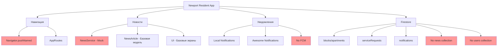

# 📊 Анализ проекта Newport Resident - Предварительный аудит

## 🎯 Цель
Анализ текущего состояния проекта для планирования внедрения модуля новостей с push-рассылками и миграции на go_router.

---

## 📦 Анализ зависимостей

### ✅ Текущие зависимости (актуальные)
```yaml
# Основные
flutter: 3.4.1+ (актуально)
provider: ^6.1.2 ✅
get_it: ^7.6.7 ✅
cloud_firestore: ^4.15.10 ✅
firebase_core: ^2.27.2 ✅
firebase_auth: ^4.18.0 ✅

# UI/UX
sizer: ^2.0.15 ✅
flutter_staggered_animations: ^1.1.1 ✅
cached_network_image: ^3.3.1 ✅

# Уведомления
awesome_notifications: ^0.10.1 ✅
```

### ❌ Отсутствующие зависимости (требуются)
```yaml
# Push-уведомления
firebase_messaging: ^15.0.0 ❌

# Навигация
go_router: ^13.0.0 ❌

# UI компоненты
badges: ^3.1.1 ❌
markdown_widget: ^2.3.1 ❌

# Тестирование
golden_toolkit: ^0.15.0 ❌
```

### ⚠️ Устаревшие зависимости
- `js` - пакет прекращен (используется как транзитивная зависимость)

---

## 🧭 Анализ навигации

### Текущая система
```dart
// Используется Navigator.pushNamed() в 15+ местах:
- lib/presentation/dashboard_screen/dashboard_screen.dart (8 мест)
- lib/presentation/news_screen/news_list_screen.dart (1 место)
- lib/presentation/authentication_screen/authentication_screen.dart (2 места)
- lib/presentation/splash_screen/splash_screen.dart (2 места)
- lib/routes/app_routes.dart (5 мест)
```

### 🔄 План миграции на go_router

#### Этап 1: Создание AppRouter
```dart
// lib/routes/app_router.dart
class AppRouter {
  static final GoRouter router = GoRouter(
    routes: [
      // Существующие маршруты через ShellRoute
      ShellRoute(
        builder: (context, state, child) => MainLayout(child: child),
        routes: [
          GoRoute(path: '/', builder: (context, state) => const SplashScreen()),
          GoRoute(path: '/dashboard', builder: (context, state) => const DashboardScreen()),
          // ... остальные маршруты
        ],
      ),
      // Новые маршруты новостей
      GoRoute(
        path: '/news',
        builder: (context, state) => const NewsListScreen(),
        routes: [
          GoRoute(
            path: ':id',
            builder: (context, state) => NewsDetailScreen(
              id: state.pathParameters['id']!,
            ),
          ),
        ],
      ),
    ],
  );
}
```

#### Этап 2: Пошаговая миграция
1. **PR #1**: Добавить go_router, создать AppRouter
2. **PR #2**: Мигрировать новости (`/news`, `/news/:id`)
3. **PR #3**: Мигрировать dashboard с badge-логикой
4. **PR #4**: Мигрировать остальные экраны

---

## 📰 Анализ модуля новостей

### ✅ Существующая реализация
```dart
// Модель (базовая)
class NewsArticle {
  final String id;
  final String title;
  final String preview;
  final String content;
  final String? imageUrl;
  final DateTime publishedAt;
  final bool isImportant;
}

// Сервис (mock данные)
class NewsService {
  Future<List<NewsArticle>> fetchLatestNews({bool forceRefresh = false});
  Future<NewsArticle?> fetchNewsById(String id);
}
```

### ❌ Отсутствующий функционал
```dart
// Требуемые поля
class NewsArticle {
  // ... существующие поля
  final List<String> ctaLabels; ❌
  final List<String> ctaLinks; ❌
  final String? ctaType; ❌ // 'external' | 'internal'
  final bool isRead; ❌
  final DateTime? readAt; ❌
}
```

### 📍 Места использования Navigator.pushNamed в news flow
1. `lib/presentation/news_screen/news_list_screen.dart:96` - переход к детали
2. `lib/presentation/dashboard_screen/dashboard_screen.dart:170` - переход к детали
3. `lib/presentation/dashboard_screen/dashboard_screen.dart:169` - переход к списку

---

## 🔥 Анализ Firestore структуры

### ✅ Существующие коллекции
```javascript
// Текущая структура
/blocks/{blockId}/apartments/{apartmentNumber}
/serviceRequests/{requestId}
/notifications/{notificationId}
/clients/{clientId}
```

### ❌ Отсутствующие коллекции
```javascript
// Требуемые коллекции
/news/{newsId} ❌
/users/{uid} ❌ // для FCM токенов
```

### 📊 Текущие правила безопасности
```javascript
// firestore.rules
// ✅ Есть правила для:
- serviceRequests (чтение/создание своих)
- notifications (чтение/обновление своих)
- clients (чтение/обновление своих)

// ❌ Отсутствуют правила для:
- news (публичные + сегментированные)
- users (FCM токены)
```

---

## 🔔 Анализ уведомлений

### ✅ Существующая система
```dart
// Локальные уведомления
class LocalNotificationService {
  // Каналы: 'admin_responses', 'general'
  // Использует awesome_notifications
}

// Отслеживание в Firestore
// serviceRequests → notifications (автоматически)
```

### ❌ Отсутствующий функционал
```dart
// FCM интеграция
- Сбор device tokens ❌
- Push-уведомления для новостей ❌
- Каналы 'news_critical', 'news_general' ❌
```

---

## 🏗️ Анализ архитектуры

### ✅ Provider + GetIt
```dart
// Текущая архитектура
- Provider: AuthService (ChangeNotifier)
- GetIt: DI контейнер для сервисов
- CacheService: кеширование через SharedPreferences
```

### 🔄 Требуемые изменения
```dart
// Новые сервисы
- NewsService (с Firestore)
- FCMService (device tokens)
- UnreadTracker (отслеживание прочитанных)

// Обновленные сервисы
- LocalNotificationService (FCM каналы)
- AuthService (FCM токены при логине)
```

---

## 📱 Анализ UI компонентов

### ✅ Существующие компоненты
```dart
// Dashboard
- NewsCarousel (превью 2 новостей)
- Badge на уведомлениях (notifications)

// News
- NewsListScreen (список)
- NewsDetailScreen (деталь)
```

### ❌ Отсутствующие компоненты
```dart
// Badge для новостей
- Badge на иконке "Новости" ❌
- Счетчик непрочитанных в превью ❌

// UI улучшения
- SliverList с pinned секциями ❌
- Hero-анимация обложки ❌
- Markdown-контент ❌
- CTA-кнопки ❌
```

---

## 🧪 Анализ тестирования

### ✅ Существующие тесты
```dart
// Unit тесты
- test/services/news_service_test.dart ✅
- test/services/auth_service_test.dart ✅

// Widget тесты
- test/widget_tests/news_list_screen_test.dart ✅
```

### ❌ Отсутствующие тесты
```dart
// Golden тесты
- DashboardBadge ❌
- NewsListItem ❌
- NewsDetailScreen ❌

// Unit тесты
- FCMService ❌
- UnreadTracker ❌
- NewsService (с Firestore) ❌
```

---

## 📊 Оценка объема работ

### 🔥 Критичные изменения (Приоритет 1)
1. **Добавить зависимости** - 0.5 часа
2. **Расширить NewsArticle модель** - 1 час
3. **Создать Firestore коллекцию news** - 2 часа
4. **Настроить FCM** - 4 часа

### ⚡ Важные изменения (Приоритет 2)
1. **Мигрировать на go_router** - 6 часов
2. **Обновить UI компоненты** - 8 часов
3. **Добавить badge-логику** - 3 часа
4. **Реализовать paging** - 4 часа

### 🎨 Желательные изменения (Приоритет 3)
1. **Golden тесты** - 4 часа
2. **Hero-анимации** - 2 часа
3. **Markdown-контент** - 2 часа

**Общий объем: ~36 часов**

---

## 🚨 Риски и ограничения

### 🔴 Высокие риски
1. **Миграция навигации** - может сломать существующие deep-links
2. **FCM настройка** - требует серверной части (Cloud Functions)
3. **Firestore правила** - сложность сегментации по блокам

### 🟡 Средние риски
1. **Производительность** - paging с большим количеством новостей
2. **Offline-кеширование** - конфликт между Firestore и CacheService
3. **Тестирование** - golden tests на разных устройствах

### 🟢 Низкие риски
1. **UI изменения** - изолированы в отдельных компонентах
2. **Модель данных** - обратная совместимость через миграцию

---

## 📋 План миграции

### Миграционный скрипт для новостей
```javascript
// Cloud Function: migrateNews
exports.migrateNews = functions.https.onRequest(async (req, res) => {
  const batch = admin.firestore().batch();
  
  // Копируем существующие новости в новый формат
  const newsSnapshot = await admin.firestore().collection('news').get();
  
  newsSnapshot.docs.forEach(doc => {
    const data = doc.data();
    batch.update(doc.ref, {
      ctaLabels: [],
      ctaLinks: [],
      ctaType: null,
      migrationDone: true
    });
  });
  
  await batch.commit();
  res.json({ success: true, migrated: newsSnapshot.size });
});
```

**Оценка скрипта:**
- Строк кода: ~50
- Поля для миграции: 3 (ctaLabels, ctaLinks, ctaType)
- Время выполнения: ~5 минут для 1000 новостей

---

## 🎯 Рекомендации

### 1. Поэтапная реализация
- Начать с FCM и базовой структуры
- Затем UI компоненты
- В конце миграция навигации

### 2. Тестирование
- Создать staging окружение для FCM
- Тестировать на реальных устройствах
- Golden tests для UI регрессий

### 3. Документация
- README_push_setup.md с пошаговой настройкой
- Схемы архитектуры
- Примеры использования

---

## 📈 Диаграмма текущего состояния



**Легенда:**
- 🔴 Красный - требует замены/добавления
- 🟡 Желтый - требует обновления
- 🟢 Зеленый - готово к использованию 